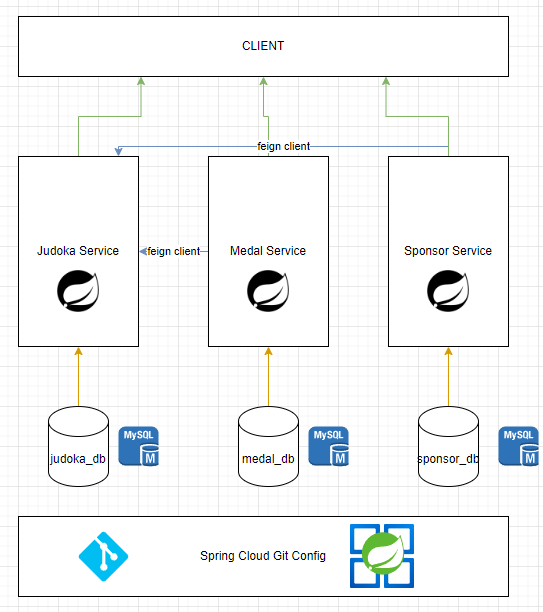

#MICROSERVICIOS CON SPRING BOOT

en este proyecto listamos judokas (practicantes de judo) con sus medallas y patrocinadores

puedes probar haciendo una solicitud GET a http://localhost:8001/judokas

1.- clona el proyecto  
2.- instala las dependencias con gradle 
3.- inicia los servicios (Primero el Config Server) 

